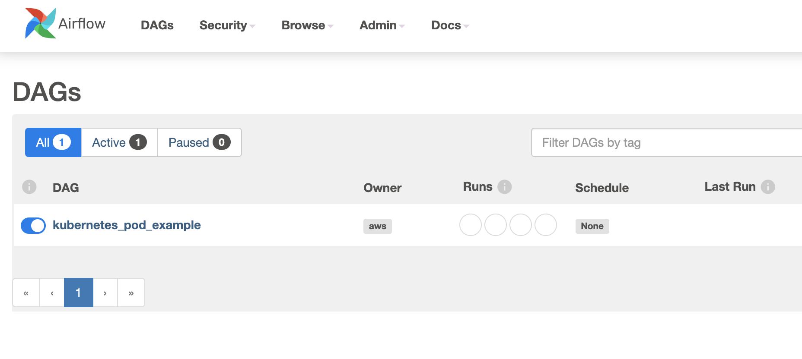

## EKS Cluster w/ Amazon Manged Workflows for Apache Airflopw (MWAA)

The example demonstrates how to use [Amazon Managed Workflows for Apache Airflow (MWAA)](https://docs.aws.amazon.com/mwaa/latest/userguide/what-is-mwaa.html) with Amazon EKS.

This example is based on the steps provided on the [MWAA documentation](https://docs.aws.amazon.com/mwaa/latest/userguide/mwaa-eks-example.html).
### Considerations

1. Ideally we recommend adding the steps to sync requirements/sync dags to the MWAA S3 Bucket as part of a CI/CD pipeline. Generally Dags development have a different lifecycle than the Terraform code to provision infrastructure.
However for simplicity we are providing steps for that using Terraform running AWS CLI commands on null_resource.

## Prerequisites:

Ensure that you have the following tools installed locally:

1. [aws cli](https://docs.aws.amazon.com/cli/latest/userguide/install-cliv2.html)
2. [kubectl](https://Kubernetes.io/docs/tasks/tools/)
3. [terraform](https://learn.hashicorp.com/tutorials/terraform/install-cli)

## Deploy

To provision this example:

```sh
terraform init
terraform apply
```

Enter `yes` at command prompt to apply


## Validate

The following command will update the `kubeconfig` on your local machine and allow you to interact with your EKS Cluster using `kubectl` to validate the deployment.

1. Run `update-kubeconfig` command:

```sh
aws eks --region <REGION> update-kubeconfig --name <CLUSTER_NAME>
```

2. List the nodes running currently

```sh
kubectl get nodes

# Output should look like below
NAME                                        STATUS                        ROLES    AGE     VERSION
ip-10-0-30-125.us-west-2.compute.internal   Ready                         <none>   2m19s   v1.22.9-eks-810597c
```

3. Log into Apache Airflow UI

- Open the Environments page on the Amazon MWAA console
- Choose an environment
- Under the `Details` section, click the link for the Airflow UI

4. Triger the DAG workflow to execute

In the Airflow UI, enable the example and then trigger it.




5. Verify that the pod was executed successfully

After it runs and completes successfully, use the following command to verify the pod:

```sh
kubectl get pods -n mwaa
```

You should see output similar to the following:

```sh
NAME                                             READY   STATUS      RESTARTS   AGE
mwaa-pod-test.4bed823d645844bc8e6899fd858f119d   0/1     Completed   0          25s
```

## Destroy

To teardown and remove the resources created in this example:

```sh
terraform destroy -auto-approve
```
---

<!-- BEGINNING OF PRE-COMMIT-TERRAFORM DOCS HOOK -->
## Requirements

| Name | Version |
|------|---------|
| <a name="requirement_terraform"></a> [terraform](#requirement\_terraform) | >= 1.0.0 |
| <a name="requirement_aws"></a> [aws](#requirement\_aws) | >= 3.72 |
| <a name="requirement_helm"></a> [helm](#requirement\_helm) | >= 2.4.1 |
| <a name="requirement_kubernetes"></a> [kubernetes](#requirement\_kubernetes) | >= 2.10 |
| <a name="requirement_random"></a> [random](#requirement\_random) | >= 3.0 |

## Providers

| Name | Version |
|------|---------|
| <a name="provider_aws"></a> [aws](#provider\_aws) | >= 3.72 |
| <a name="provider_kubernetes"></a> [kubernetes](#provider\_kubernetes) | >= 2.10 |
| <a name="provider_random"></a> [random](#provider\_random) | >= 3.0 |

## Modules

| Name | Source | Version |
|------|--------|---------|
| <a name="module_eks_blueprints"></a> [eks\_blueprints](#module\_eks\_blueprints) | github.com/aws-ia/terraform-aws-eks-blueprints | v4.10.0 |
| <a name="module_eks_blueprints_kubernetes_addons"></a> [eks\_blueprints\_kubernetes\_addons](#module\_eks\_blueprints\_kubernetes\_addons) | github.com/aws-ia/terraform-aws-eks-blueprints//modules/kubernetes-addons | v4.10.0 |
| <a name="module_mwaa"></a> [mwaa](#module\_mwaa) | aws-ia/mwaa/aws | 0.0.1 |
| <a name="module_s3_bucket"></a> [s3\_bucket](#module\_s3\_bucket) | terraform-aws-modules/s3-bucket/aws | ~> 3.0 |
| <a name="module_vpc"></a> [vpc](#module\_vpc) | terraform-aws-modules/vpc/aws | ~> 3.0 |

## Resources

| Name | Type |
|------|------|
| [aws_s3_bucket_object.kube_config](https://registry.terraform.io/providers/hashicorp/aws/latest/docs/resources/s3_bucket_object) | resource |
| [aws_s3_bucket_object.uploads](https://registry.terraform.io/providers/hashicorp/aws/latest/docs/resources/s3_bucket_object) | resource |
| [kubernetes_namespace_v1.mwaa](https://registry.terraform.io/providers/hashicorp/kubernetes/latest/docs/resources/namespace_v1) | resource |
| [kubernetes_role_binding_v1.mwaa](https://registry.terraform.io/providers/hashicorp/kubernetes/latest/docs/resources/role_binding_v1) | resource |
| [kubernetes_role_v1.mwaa](https://registry.terraform.io/providers/hashicorp/kubernetes/latest/docs/resources/role_v1) | resource |
| [random_id.this](https://registry.terraform.io/providers/hashicorp/random/latest/docs/resources/id) | resource |
| [aws_availability_zones.available](https://registry.terraform.io/providers/hashicorp/aws/latest/docs/data-sources/availability_zones) | data source |
| [aws_caller_identity.current](https://registry.terraform.io/providers/hashicorp/aws/latest/docs/data-sources/caller_identity) | data source |
| [aws_eks_cluster_auth.this](https://registry.terraform.io/providers/hashicorp/aws/latest/docs/data-sources/eks_cluster_auth) | data source |

## Inputs

| Name | Description | Type | Default | Required |
|------|-------------|------|---------|:--------:|
| <a name="input_eks_cluster_version"></a> [eks\_cluster\_version](#input\_eks\_cluster\_version) | EKS Cluster version | `string` | `"1.23"` | no |
| <a name="input_name"></a> [name](#input\_name) | Name of the VPC and EKS Cluster | `string` | `"managed-airflow-mwaa"` | no |
| <a name="input_region"></a> [region](#input\_region) | region | `string` | `"us-west-2"` | no |
| <a name="input_vpc_cidr"></a> [vpc\_cidr](#input\_vpc\_cidr) | VPC CIDR | `string` | `"10.0.0.0/16"` | no |

## Outputs

| Name | Description |
|------|-------------|
| <a name="output_configure_kubectl"></a> [configure\_kubectl](#output\_configure\_kubectl) | Configure kubectl: make sure you're logged in with the correct AWS profile and run the following command to update your kubeconfig |
<!-- END OF PRE-COMMIT-TERRAFORM DOCS HOOK -->
